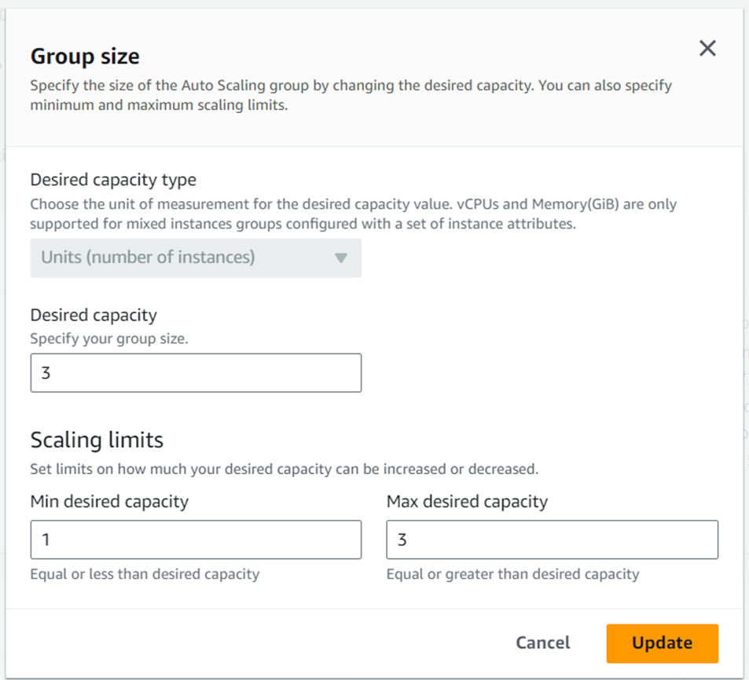

# Terraform-Infrastructure-Scaling
**Terraform-Infrastructure-Scaling**

**Understanding Scaling**

Scaling is the process of adding or removing resources to match the changing demands of your application. As your application grows, more resources may be needed to handle increased load. Similarly, as the load decreases, unnecessary resources can be removed to save costs.

Terraform simplifies this process by allowing you to declaratively define your infrastructure. You can specify the number of resources required, and Terraform will automatically create or destroy them as needed.

**Task 1: Create an Auto Scaling Group**

Auto Scaling Groups (ASGs) enable automatic scaling of EC2 instances based on current demand. The following steps demonstrate how to create an ASG using Terraform:

**In your main.tf file, include the following code to define your Auto Scaling Group:**

Run terraform init and terraform apply to create the autoscaling group using the Terraform configuration.

 

You can check for syntactical errors in your Terraform files using the terraform validate command. This will ensure the configuration is correct before applying changes.

**terraform validate**
Runs a syntax check on the configuration files.

To ensure consistent indentation and formatting across your configuration files, use the terraform fmt command.

**terraform fmt**
Automatically formats Terraform configuration files according to style conventions.

Before applying changes, it's best practice to preview the planned modifications using the terraform plan command. This will show the intended changes without making any actual modifications.

**terraform plan**
Provides an execution plan, outlining the actions Terraform will take.

**Auto-approve Infrastructure Creation**
To bypass interactive approval prompts and create infrastructure immediately, use the terraform apply -auto-approve command.

**terraform apply -auto-approve**
Executes the apply command without requiring confirmation.

After the process completes, verify that the EC2 instances have been successfully created:

**Task 2: Test Auto Scaling**
To ensure Auto Scaling works as expected, follow these steps to test scaling in AWS:

**Verify Auto Scaling Group in AWS**
Navigate to the **AWS Management Console → Auto Scaling Groups** and locate the Auto Scaling Group you created.

**Modify the Auto Scaling Group**
Click the Group details section and select the Edit button to modify the scaling configuration.

**Monitor Instance Launching**
After making changes, allow a few minutes for new instances to launch based on the scaling policy.

**Verify EC2 Instances**
Go to the EC2 Instances service and verify that new instances have been created.

**Terminate Instances to Test Scaling**
Manually terminate one of the EC2 instances, and observe the Auto Scaling Group automatically launch a replacement instance to maintain the desired capacity.

**Verifying Auto Scaling Behavior**
To verify that the Auto Scaling Group is functioning correctly when an EC2 instance is terminated:

Terminate an instance manually via the AWS EC2 Console.
Monitor the Auto Scaling Group to confirm that it automatically provisions a new instance to replace the terminated one, maintaining the desired capacity.